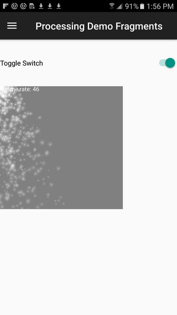

# ProcessingAndroidDemo
This fork of ProcessingAndroidDemo adds Android GUI fragment(s) combined with Processing sketches for experimentation.

For information about fragments see https://github.com/codepath/android_guides/wiki/Creating-and-Using-Fragments

For data transfer between fragmets see http://stackoverflow.com/questions/35038000/how-to-improve-interaction-between-android-studio-class-and-processing-sketch

This code now uses Android mode fragments v4 version.

##New Screenshots:

ORIGINAL:
This demo explains how to embed processing sketch in your own app. For a step by step guide, head over to this wiki - https://github.com/processing/processing-android/wiki/Using-Eclipse-or-Android-Studio-for-Development

##Screenshots:

